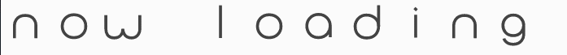

# ProgressText.js

## Overview
 progress bars with animated SVG paths. 

##Installing
Including dist/progresText.js or dist/progressbar.min.js from latest tag to your project.

## Usage
    // Assuming we have an empty 

 in HTML
    const id = 'container';
    const progressText = new ProgressText(id, {easingName: 'easeInQuad'});
    progressText.animate(1.0); //value from 0.0 to 1.0

## License
MIT License
